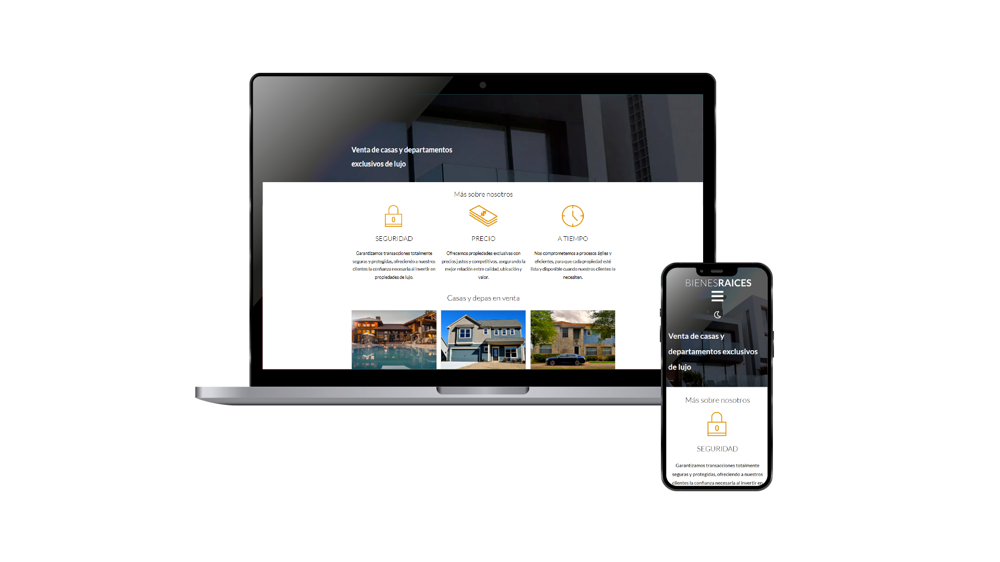

# Bienes Raices

  

**Bienes Raíces** es un portal web con panel administrativo desarrollada como proyecto formativo.  
El objetivo es ofrecer una presentación atractiva y funcional de la empresa y su producto a los usuarios, así como proveer a la empresa de las herramientas necesarias para actualizar el contenido de la misma mediante un panel administrativo.

El proyecto está desarrollado con **HTML, CSS (SASS), JavaScript y PHP**, utilizando **Node.js y Gulp** para automatización de tareas y **devcontainers** para entornos de desarrollo consistentes.

---

## Tecnologías y Librerías
    

- **HTML5 & CSS3**: Estructura y estilos de la página.  
- **SASS**: Preprocesador CSS para estilos más organizados y mantenibles.  
- **JavaScript**: Sticky menu y galería de imágenes.  
- **Gulp**: Automatización de tareas como compilación de SASS, minificación y construcción del proyecto.  
- **Node.js**: Entorno de ejecución para herramientas de desarrollo.
- **PHP**: Backend 
- **Devcontainers**: Contenerización del entorno de desarrollo para consistencia entre distintos equipos y máquinas.

---

## Arquitectura MVC

El proyecto sigue el patrón **Modelo-Vista-Controlador (MVC)**:

- **Modelo**: Gestiona la lógica de datos y la comunicación con la base de datos (propiedades, usuarios, autenticación).  
- **Vista**: Se encarga de mostrar la información al usuario mediante HTML, CSS y componentes dinámicos con JavaScript.  
- **Controlador**: Procesa las solicitudes de los usuarios, ejecuta la lógica de negocio y conecta el Modelo con la Vista.  

Esta estructura favorece la **escalabilidad, mantenibilidad y separación de responsabilidades** dentro del proyecto.